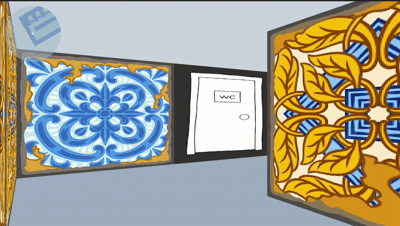
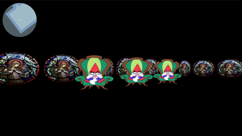

# cub3D

A little RayCaster with [MLX42](https://github.com/42-Fundacion-Telefonica/MLX42)

## Collaborators

> - [pablo-is-a-goblin](https://github.com/pablo-is-a-goblin)
> - [witemirlo](https://github.com/witemirlo)

## Gameplay

## About the project

- This proyects aims to create a raycasting engine in C
- The walls have custom textures and collisions
- Navigate the map with WASD and change the view with the arrow keys
- Switch cursor usage with c key
- Optional use of animated sprites
- Open and close doors with SPACE key
- You can create your custom maps
- See your location with the minimap
